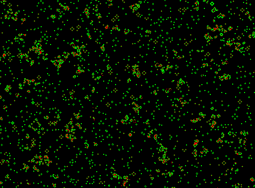

# WebGPU Game of Life
Implementation of Conway's Game of Life using the GPU.

## [Try it here!](https://hypothete.com/projects/2022/game-of-life/)

## How to build and run

* Install with `yarn`
* Build with `yarn build`
* Run an interactive Snowpack server with `yarn start`. Snowpack should open a tab at `http://localhost:8080` that runs the app.